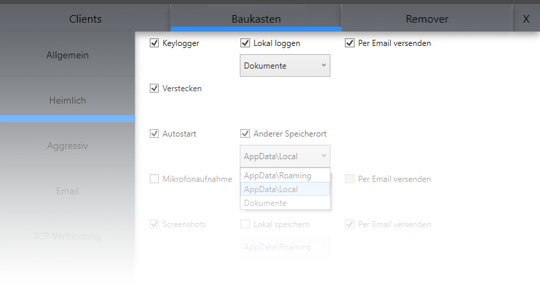

# DNAV - Definitely Not A Virus
DNAV ist ein in C# entwickelter Trojaner, welcher Daten auf einem Opfer PC sammelt. Diese Daten werden per Email an den Angreifer übertragen.

  

## Entwicklungshinweise
**Der master branch enthält nur stabile releases.** Jeder contributor erhält einen eigenen branch, in dem beliebig gearbeitet werden kann. Wenn eine Funktion eines contributors fertig ist, wird der entsprechende branch in den development branch gemerged. Sollten alle geplanten Funktionen im development branch sein, wird der development branch in den master branch gemerged und ein Release erstellt.

## Funktion
DNAV war zum Anfang des Projektes ein einfacher Trojaner, welche die typischen Features eines solchen Trojaners umfasste. Im Laufe der Entwicklung kam es zu der Entscheidung, dass es nicht mehr nur bei einem Trojaner bleiben soll, sondern eine ganze Umgebung um diesen aufgebaut werden soll. Dieser Umgebung ist eine Steuerzentrale, mit der alle Opfer des Trojaners kontrolliert werden können. Zudem können Trojaner mit beliebigen Featurezusammensetzungen durch die grafische Oberfläche erzeugt werden.

## Mögliche Funktionen
Folgende Funktionen können für den Trojaner gewählt werden:
- Keylogger
- Verstecken des Trojaners
- Autostart des Trojaners
- Mikrofonaufnahme
- Screenshots
- Speichern dieser Daten auf dem Opfer PC
- Versand dieser Daten über Email Anhänge
- CMD deaktivieren
- Ausführen Dialog deaktivieren
- Taskmanager deaktivieren
- Windows Taste deaktivieren
- Powershell deaktivieren
- RegEdit deaktivieren
- Taskleiste deaktivieren
- Neue Benutzeraccounts anlegen

## Präferenzen
Um das Projekt zu compilieren, wird Visual Studio 2019 mit installiertem .NET Framework SDK in der Version 4.7.2 erfordert.

[Visual Studio 2019 Download](https://visualstudio.microsoft.com/de/vs/)